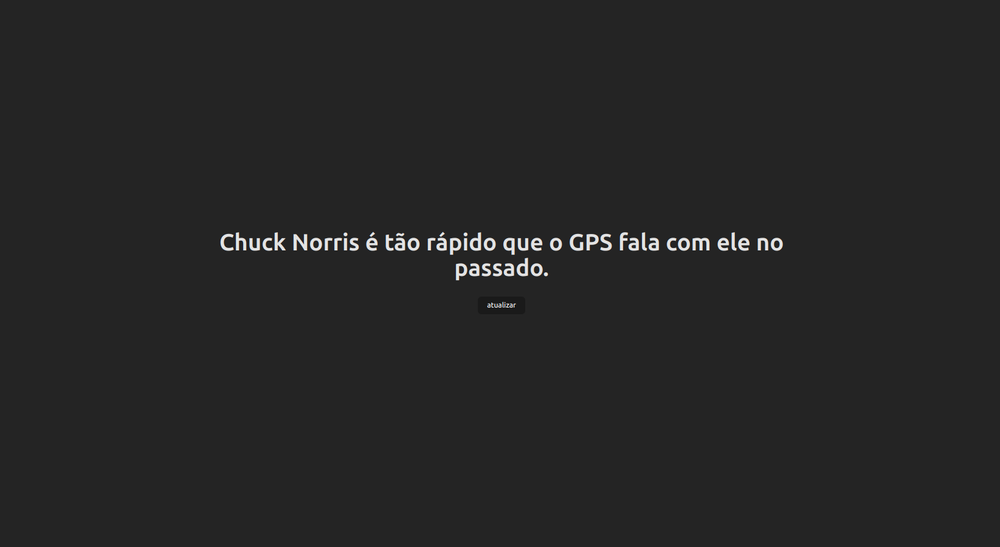

# Chuck Norris API piadas #




## Como Executar

<strong> Para uma melhor experiência tenha a extensão do google translate instalada </strong>

Siga estas etapas para executar o projeto localmente:

### 1. Pré-requisitos

- Certifique-se de ter o Node.js instalado em sua máquina. Você pode baixá-lo em [nodejs.org](https://nodejs.org/).

### 2. Clonar o Repositório

Clone este repositório para o seu ambiente local:

```bash
git clone https://github.com/Tiagoamrein/chuck-norris-api 
cd chuck-norris-api
npm install
npm run dev ```
